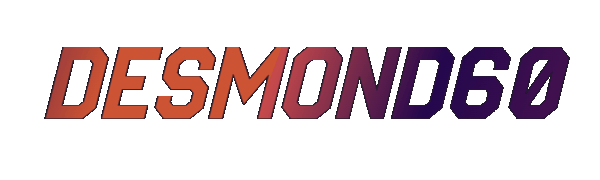

<h1 align="center"></h1>

***

### 🐘  🎀  𝐼𝒟𝐸𝓈/𝐸𝒹𝒾𝓉𝑜𝓇𝓈:  🎀  🐘

### ★✩  🎀  𝐿𝒶𝓃𝑔𝓊𝒶𝑔𝑒𝓈:  🎀  ✩★

### 💘  🎀  𝐹𝓇𝒶𝓂𝑒𝓌𝑜𝓇𝓀𝓈, 𝒫𝓁𝒶𝓉𝒻𝑜𝓇𝓂𝓈 𝒶𝓃𝒹 𝐿𝒾𝒷𝓇𝒶𝓇𝒾𝑒𝓈:  🎀  💘

### ♫  🎀  𝑀𝓊𝓈𝒾𝒸:  🎀  ♫

### ✎  🎀  𝒮𝑜𝒸𝒾𝒶𝓁:  🎀  ✎

### 🎮  🎀  𝒢𝒶𝓂𝑒:  🎀  🎮

### ✴  🎀  𝒮𝓂𝒶𝓇𝓉𝓅𝒽𝑜𝓃𝑒 𝐵𝓇𝒶𝓃𝒹𝓈:  🎀  ✴

***

## GitHub Readme Streak Stats

***

***

***

